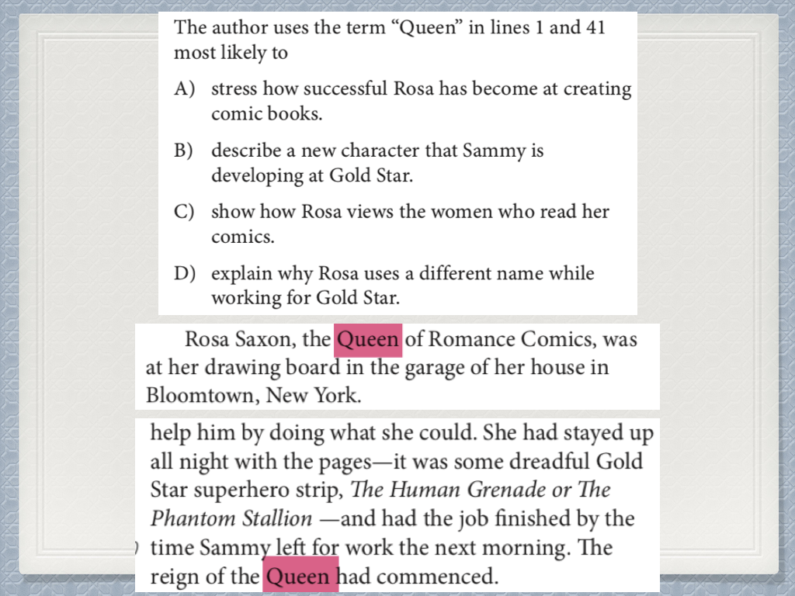
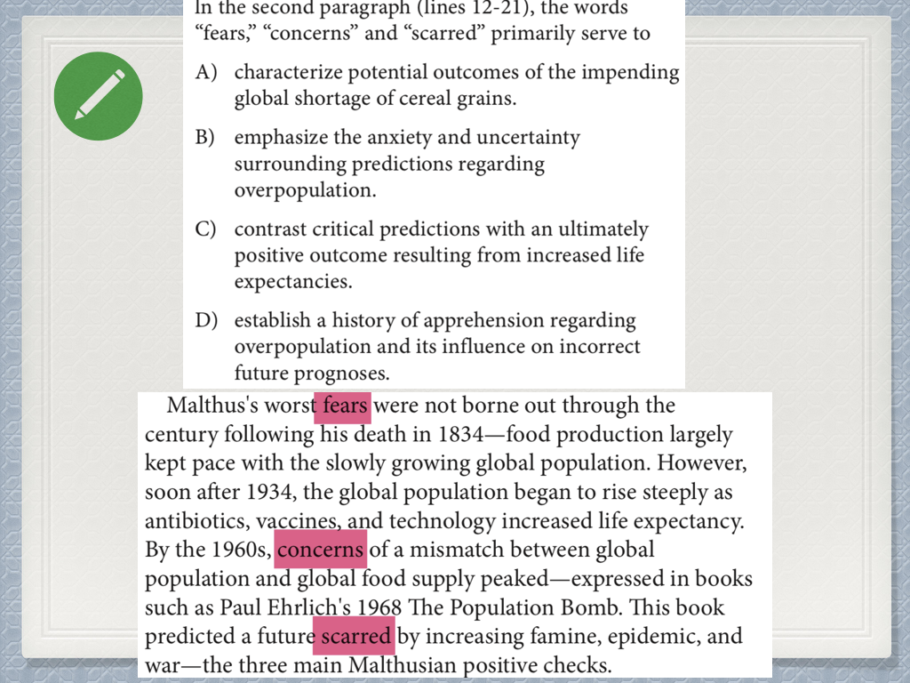
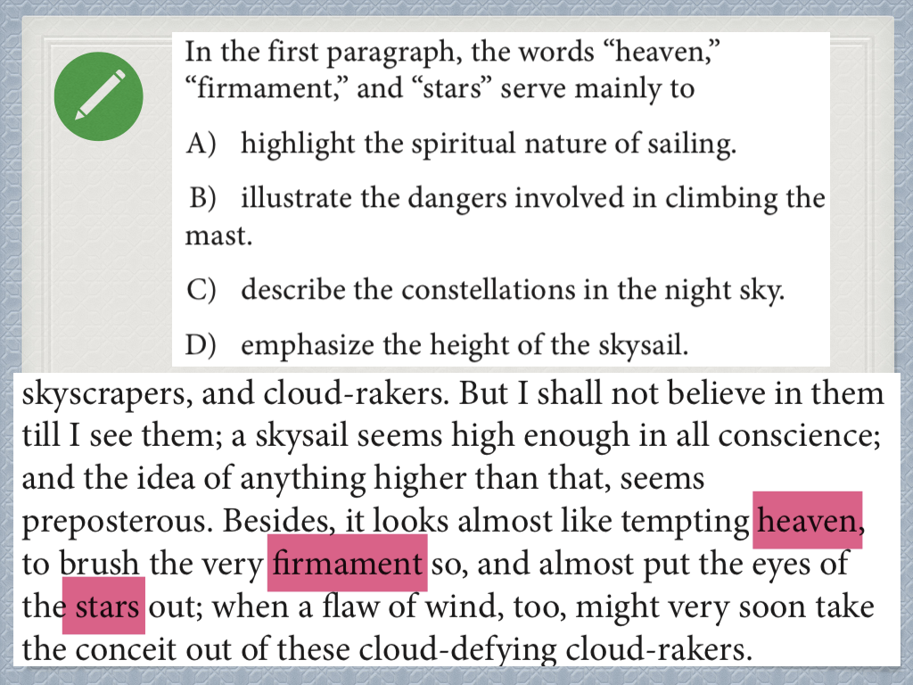
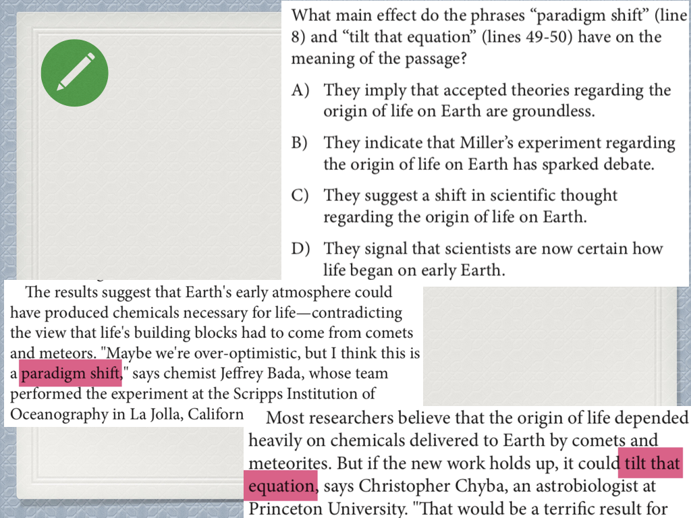
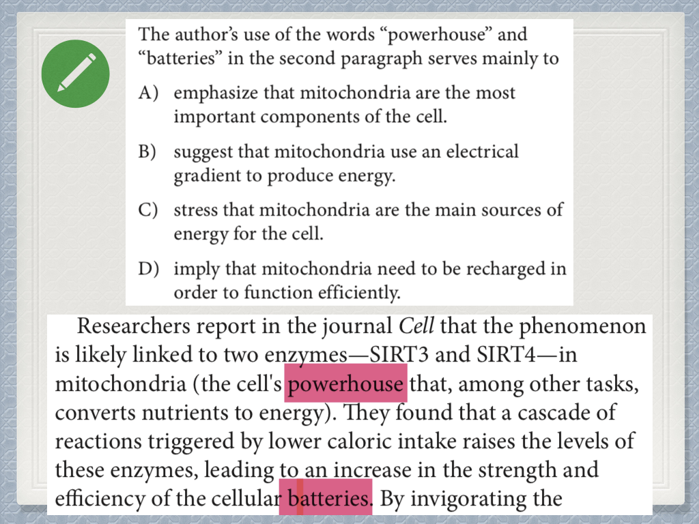
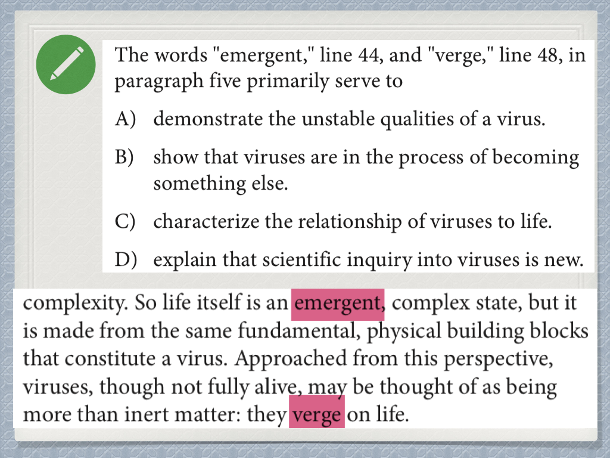
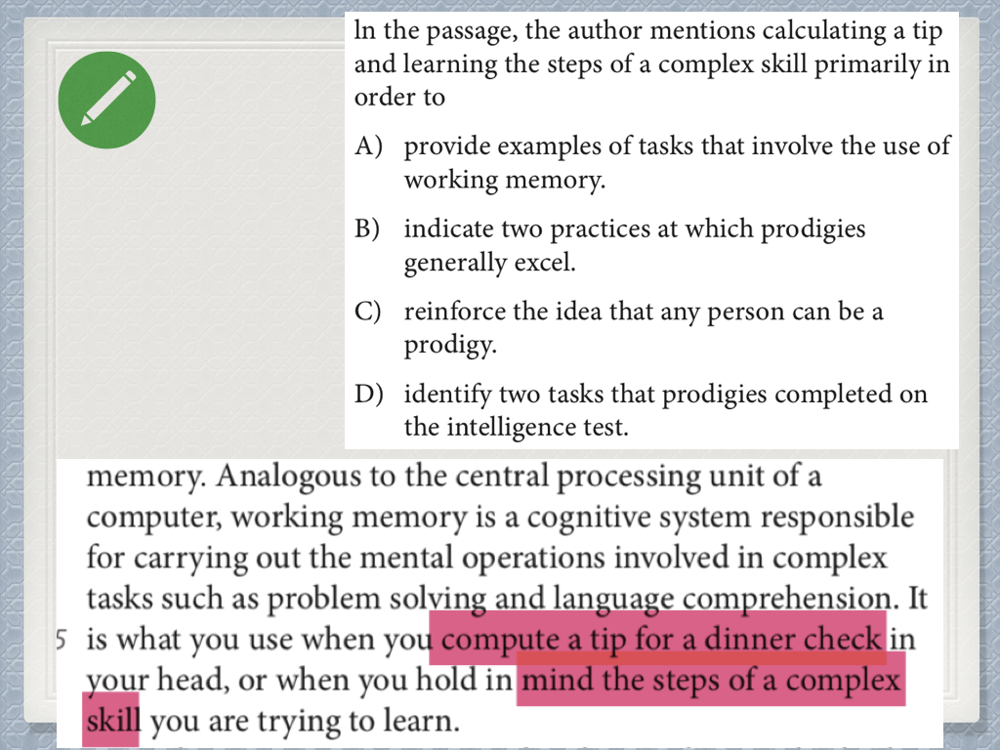
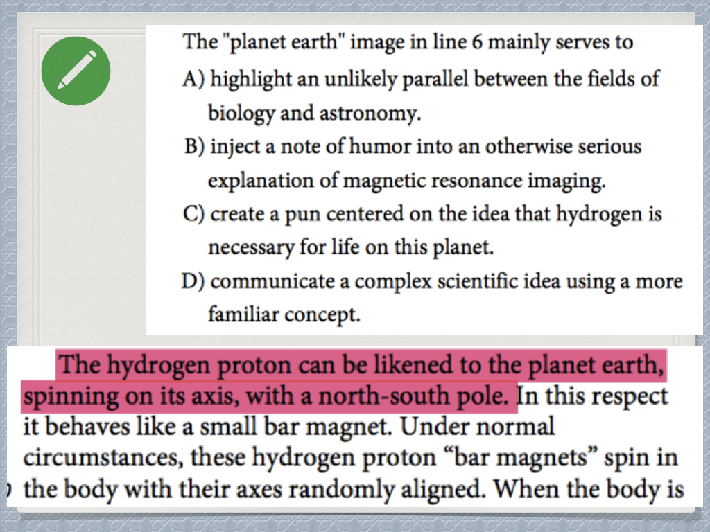

<notice>教程读者请不要直接阅读本文件，因为诸多功能在此无法正常使用，请移步至[程谱 coderecipe.cn](https://coderecipe.cn/learn/10)学习完整教程。如果您喜欢我们的教程，请在右上角给我们一个“Star”，谢谢您的支持！</notice>

Chapter 2 — 题型方法论：目的题，态度题， 和证据题
======

从这一章开始，我们将正式进入题型方法论的讲解。我们在上一章专门讲过了SAT阅读中的主要题型，并让大家做了辨析，我们很快就会看到辨析题型是一个非常重要的能力。在这一章，我们将会首先讲到目的题，态度题，证据题，和词汇题的方法论。很多同学可能会觉得不解，题型怎么可能不依托于文章存在呢？或者说，难道不看完全篇文章就能做出题目吗？

事实上，SAT阅读中不同的题型会有不同的做法，大部分题型也根本不需要读完全文才能做出来。对于需要对文章整体内容有了解之后才能做的题目我们叫做全文题，比如主旨题和证据题；而对于只看文章某一句话或几句话就可以解出来的我们叫做细节题，大部分题目其实都属于细节题目，比如循证题，目的题，词汇题等。

因此，我们才会发展出针对不同题型的方法论。题型方法论介绍完之后我们才会过渡到文章方法论，由点到线。接下来，我们就一起开始学习吧！

Checkpoint 1 — 温馨提示
-----

根据之前学生的反馈和我自身的教学经验，学生在学习题型方法论之前，最好已经有接触过SAT具体的题目，至少做过5篇SAT阅读题目才能对题型有大概的概念。如果之前没有接触过题目而直接学习方法论的话可能比较难理解，并觉得过于抽象或理论化。

Checkpoint 2 — 态度题解题方法论
-----

态度题整体来讲在SAT阅读题型中属于出现频次较低的，可能一套阅读题中会出现一道题目。态度题属全文题，需要对文章有整体了解后比较好做，因此我们不做过多的讲解，当在文章中遇到具体题目时再详细讲解。

<cr type="player" parameters="XMzgzODgzNjgxNg=="><notice>播放器功能在此无法正常显示，请移步至[程谱 coderecipe.cn](https://coderecipe.cn/learn/10)查看。</notice></cr>

密码：R101

Checkpoint 3 — 证据题（Evidence题）方法论
-----

同态度题一样，证据题在SAT阅读中的出现频率也不算很高，并且也属于全文题，所以我们还是以一个简短的视频讲解来概括证据题。

<cr type="player" parameters="XMzg0NDIwNTE5Mg=="><notice>播放器功能在此无法正常显示，请移步至[程谱 coderecipe.cn](https://coderecipe.cn/learn/10)查看。</notice></cr>

密码：REvidence

Checkpoint 4 — 目的题整体方法论
-----
目的题是SAT阅读题型中除循证题之外第二大的题型，因此也是我们题型方法论讲解的重点。在第一个视频中，我们先介绍目的题的基本方法论和基本类型。

<cr type="player" parameters="XMzgzODgzOTg2OA=="><notice>播放器功能在此无法正常显示，请移步至[程谱 coderecipe.cn](https://coderecipe.cn/learn/10)查看。</notice></cr>

密码：R102

请大家一定记住目的题的最根本解题原则：本句+上句+下句

Checkpoint 5 — 修辞类目的题解题技巧和例题
-----

在这讲中，我们介绍了目的题中的修辞目的题的解题技巧和方法。一般来讲，修辞目的题针对一个单词或短语提问。针对这种修辞目的题，我们还是依旧要读到提问位置的本句和上句来解题，但是有一个小技巧：修辞目的题的正确答案一定有提问单词或短语的修辞作用，具体讲解请看下面的视频。

<cr type="player" parameters="XMzgzODg0NjU2NA=="><notice>播放器功能在此无法正常显示，请移步至[程谱 coderecipe.cn](https://coderecipe.cn/learn/10)查看。</notice></cr>

密码：R103

接下来大家再做几道修辞目的题进行巩固：

<cr type="hidden" parameters="点击查看答案"><notice>隐藏内容功能在此无法正常显示，请移步至[程谱 coderecipe.cn](https://coderecipe.cn/learn/1)查看。</notice>正确答案：正确选项是：A</cr>

<cr type="hidden" parameters="点击查看答案"><notice>隐藏内容功能在此无法正常显示，请移步至[程谱 coderecipe.cn](https://coderecipe.cn/learn/1)查看。</notice>正确答案：正确选项是：B</cr>

<cr type="hidden" parameters="点击查看答案"><notice>隐藏内容功能在此无法正常显示，请移步至[程谱 coderecipe.cn](https://coderecipe.cn/learn/1)查看。</notice>正确答案：正确选项是：D</cr>

<cr type="hidden" parameters="点击查看答案"><notice>隐藏内容功能在此无法正常显示，请移步至[程谱 coderecipe.cn](https://coderecipe.cn/learn/1)查看。</notice>正确答案：正确选项是：C</cr>

<cr type="hidden" parameters="点击查看答案"><notice>隐藏内容功能在此无法正常显示，请移步至[程谱 coderecipe.cn](https://coderecipe.cn/learn/1)查看。</notice>正确答案：正确选项是：C</cr>

<cr type="hidden" parameters="点击查看答案"><notice>隐藏内容功能在此无法正常显示，请移步至[程谱 coderecipe.cn](https://coderecipe.cn/learn/1)查看。</notice>正确答案：正确选项是：B</cr>

Checkpoint 6 — 特殊目的题解题技巧和例题
-----

讲完了目的题中的第一种分类修辞目的题，接下来让我们看一下第二种目的题：特殊目的题。我将目的题中经常有固定的答案模式的题目问法总结成了特殊目的题。

<cr type="player" parameters="XMzgzODg0Nzk1Mg=="><notice>播放器功能在此无法正常显示，请移步至[程谱 coderecipe.cn](https://coderecipe.cn/learn/10)查看。</notice></cr>

密码：R104

接下来大家再做几道特殊目的题进行巩固：

<cr type="hidden" parameters="点击查看答案"><notice>隐藏内容功能在此无法正常显示，请移步至[程谱 coderecipe.cn](https://coderecipe.cn/learn/1)查看。</notice>正确答案：正确选项是：A</cr>

<cr type="hidden" parameters="点击查看答案"><notice>隐藏内容功能在此无法正常显示，请移步至[程谱 coderecipe.cn](https://coderecipe.cn/learn/1)查看。</notice>正确答案：正确选项是：D</cr>

接下来的内容请查看[完整阅读教科书](https://coderecipe.cn/learn/17)